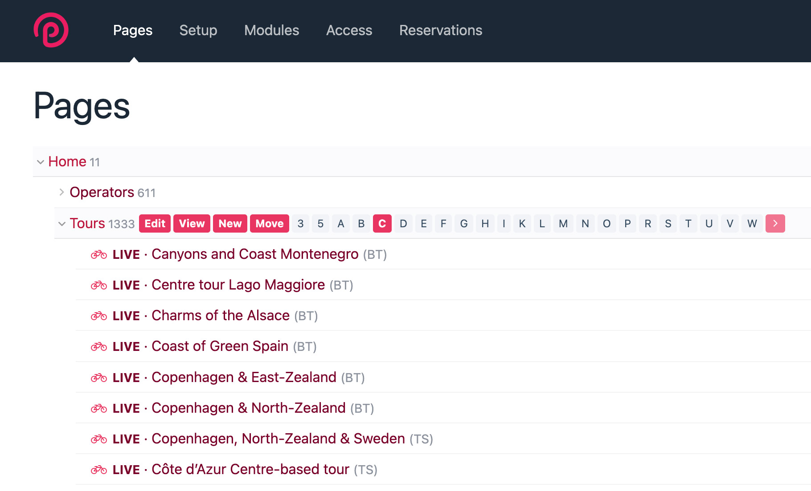

# Page List Filter for ProcessWire

This is an admin helper that enables you to easily filter pages in the page list with a click, 
such as first letter (A-Z, etc.).

This module requires ProcessWire 3.0.245 or newer (currently the dev branch). 

Currently the module just supports letter or number prefix filters of pages
(i.e. A-Z, 0-9) but more filters are likely to be added in future versions.

**This is a beta version that has not yet been tested beyond my own specific 
use cases.** Please let me know if you run into any issues, and test thoroughly
in a development environment before using in production. 


## About 



This module enables you to have filter actions for children of pages that you define in the
module settings. This enables you to click and show just pages that start with a specific 
letter, for example. This is useful for child pages that are sorted by name or title. Other types
of filters are likely to be added in future versions as well.

What filters to use are detected automatically by the starting letter of each page title
(or whatever field they are sorted by).

## Considerations and limitations

**Where to use it**  
This module is only useful for parent pages having children sorted by title or name, or some 
other "text" field that you've defined, that also happens to be used in the page list label.

This module would not be useful for manually sorted pages. It also wouldn't currently be 
useful for pages sorted by dates, though may be in the future as we add more filter options.

**Pagination**  
Currently the only type of pagination supported for filtered pages is the "More" button 
pagination. Future versions may add support for page-number pagination. You can still use
page-number pagination when using the "view all" option (what you get when clicking the 
page label in the page list). 

## Installation

1. Copy all the files from this module into /site/modules/PageListFilter/
2. In your admin go to: Modules > Refresh.
3. Click install for: Modules > Site > Page > PageListFilter.
4. On the module configuration screen, configure the module (see section below).

## Configuration

After installing the module, it will ask you for selectors (one per line) that match the 
parent pages having children you want to provide filter options for. 

The pages that you match with your selectors must have children that are automatically
sorted by some text field that is also used in the page list label. The most common 
case would be pages sorted by "title" or "name", and "title" is the default page list
label for most pages. 

For example:

```
id=1234
```
Show filters for children of parent page having id 1234. Use an id selector like this 
for the best performance. 

``` 
name=products
```
Show filters for children of parent page having name 'products'.

```
template=events
```
Show filters for children of parent having the 'events' template.

While not the most readable, the `id=1234` selector syntax offers the best
performance, at least when operating at a very large scale. 

If your page "title" almost always matches your page "name" then
note that it may be preferable configure the parent page (or its template) to sort 
its children by "name". It will typically be faster than sorting by "title" since 
the "name" column is native to the pages table. This is true in general and not
specific to this module. 


## Roadmap

Currently the module just supports letter or number prefix filters of pages
(i.e. A-Z, 0-9) but more filters are likely to be added in future versions.

I'd like to support full pagination rather than just "More" pagination in a 
future version. 

I plan to add support for filter groups where the module automatically combines filter 
prefixes to reach a target number of pages for each filter. For instance,
it might combine "A" through "C" in a group called "A—C". And clicking on the
A—C group would show all pages starting with letters A, B and C. This would mean
fewer potential filters to click on, and a more consistent amount of pages in 
each filter group. 

This version has a fairly minimal configuration screen. I plan to improve this
with template and/or parent selection options in a next version, so that you
do not have to enter selectors unless you want to.

---
Copyright 2025 by Ryan Cramer Design, LLC